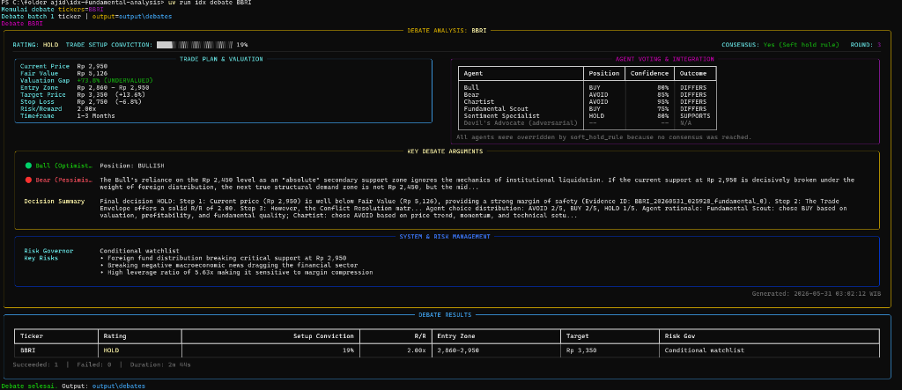
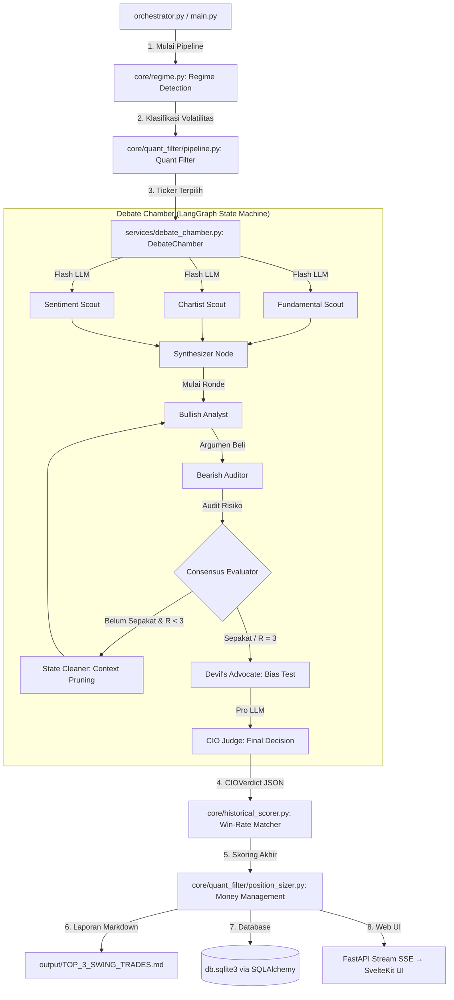

# IDX Debate Engine

> **An institutional-grade, multi-agent AI research pipeline for swing-trade analysis on the Indonesian Stock Exchange (IDX/IHSG).**

Built for *decision-support*, not decision-making. This system automates the transition from quantitative screening to structured qualitative auditing through a **LangGraph-powered debate architecture** — engineered to surface blind spots, enforce financial guardrails, and produce auditable, deterministic trade setups.


## Live Demo — Debate Chamber CLI

<p align="center">
  
</p>

<p align="center"><em>
  Rich terminal dashboard running <code>uv run idx debate BBRI</code> — showing the Trade Plan & Valuation panel, Agent Voting & Integration matrix, Bull vs Bear key arguments, Decision Summary, System & Risk Management flags, and the final Debate Results table. All in real-time.
</em></p>

---

## Table of Contents

- [System Architecture](#system-architecture)
- [Technical Highlights](#technical-highlights)
  - [LangGraph Multi-Agent Debate Chamber](#1-langgraph-multi-agent-debate-chamber)
  - [Quantitative Screener (v3.2)](#2-quantitative-screener-v32)
  - [Market-Adaptive Regime Detection](#3-market-adaptive-regime-detection)
  - [Deterministic Risk Governor](#4-deterministic-risk-governor)
  - [Adaptive Planner & Resilience Engine](#5-adaptive-planner--resilience-engine)
  - [FastAPI Backend + Svelte 5 Dashboard](#6-fastapi-backend--svelte-5-dashboard)
  - [RAG Evidence Store](#7-rag-evidence-store)
  - [Backtest Memory & Auto-Evaluator](#8-backtest-memory--auto-evaluator)
- [Project Structure](#project-structure)
- [Setup & Installation](#setup--installation)
- [Execution & CLI Reference](#execution--cli-reference)
- [Testing](#testing)
- [License](#license)

---

## System Architecture

The pipeline is **sequential at the batch level** and **parallel at the agent level**. Each ticker traverses the entire graph before the next one begins, ensuring clean state isolation and predictable token budgeting.



---

## Technical Highlights

### 1. LangGraph Multi-Agent Debate Chamber

**File:** [`debate_chamber.py`](services/debate_chamber.py) &nbsp;·&nbsp; **Prompt corpus:** [`debate_prompts/`](services/debate_prompts/)

The debate engine models an institutional investment committee using a LangGraph `StateGraph` with typed `DebateChamberState`. The architecture is purpose-built to counteract positive-bias common in single-prompt LLM analysis.

**Scout Phase** *(parallel, gemini-flash-lite):*

Three specialized agents run concurrently to extract distinct signal types before the debate begins:

| Agent | Signals | Source |
|---|---|---|
| **Fundamental Scout** | EPS TTM, ROE, DER, PBV, Graham Number, multi-method fair value | [`fair_value_calculator.py`](services/fair_value_calculator.py) |
| **Chartist** | MA50, MA200, RSI, ATR — pre-computed in Python, not LLM-generated | yfinance OHLCV |
| **Sentiment Scout** | News freshness scoring, Stockbit analyst signals, breaking-news detection | Multi-source aggregation |

**Debate Phase** *(up to 3 rounds):*

- **Anti-groupthink protocol:** Bull (R1 → R2) vs. Bear (R1 → R2). In R2, Bear is programmatically forbidden from repeating any argument from R1 and must challenge the Bull's margin of safety using ATR-based downside.
- **Devil's Advocate node:** triggered automatically if consensus is detected too early (Round 1). A contrarian agent stress-tests the agreement before it reaches the CIO.
- **State Cleaner:** prunes accumulated context between phases to prevent token overflow in long debates.

**CIO Judge** *(gemini-pro-preview):*

- Applies a strict **Conflict Resolution Matrix**: `Fundamental ✅ + Technical ✅ → BUY`, `Fundamental ✅ + Technical ❌ → HOLD`, etc.
- Checks disagreement type (`direction`, `valuation`, `catalyst`, `timing`) and applies confidence penalties (0.02–0.05).
- **Hard ExDate gate:** if ex-dividend date is ≤7 days away, auto-disqualifies with AVOID regardless of fundamentals.
- Output is **Pydantic-validated** ([`CIOVerdict`](schemas/debate.py)) — LLM output that fails schema validation is rejected and retried.

**Token budget:** 500k tokens per run. Flash models for all data extraction; Pro model reserved for CIO synthesis only.

---

### 2. Quantitative Screener (v3.2)

**Files:** [`config.py`](core/quant_filter/config.py) · [`pipeline.py`](core/quant_filter/pipeline.py)

A multi-stage screening engine that processes IDX Excel workbooks into a ranked candidate list. All filters are deterministic and configurable.

**Stage 1 — Static Gate** *(hard excludes):*

| Filter | Threshold | Rationale |
|---|---|---|
| Min price | Rp 100 | Remove penny stocks with no institutional liquidity |
| DER cap | Sector-aware (banks: 8.0×, tech: 1.0×) | Banking leverage is structural, not a risk signal |
| PBV ceiling | 6.0× (hard), 80th percentile (sector-relative) | Valuation ceiling |
| ROE floor | ≥ 10% TTM | Minimum profitability |
| Piotroski F-Score | ≥ 4 | Eliminate deteriorating fundamentals |
| Altman Z-Score | > 1.1 | Distress zone exclusion |
| Special Monitoring | Excluded | IDX `PEMANTAUAN KHUSUS` tickers are auto-rejected |

**Stage 2 — Technical Gate:**

- Price ≥ SMA50 and ≥ EMA20 (trend alignment)
- RSI hard-reject above 80 (overbought exclusion)
- 20-day ADT ≥ Rp 5 billion (institutional liquidity)
- Minimum 60 OHLCV bars (data sufficiency)
- Relative Strength vs. IHSG (1-month outperformance)

**Stage 3 — Composite Scoring (0–100):**

| Component | Weight | Method |
|---|---|---|
| Valuation | 20 | Graham Number gap, tiered: ≥50% → 100%, 20–50% → 70%, 5–20% → 40% |
| Profitability | 10 | ROE tiered: ≥25% → 100%, 15–25% → 70%, 10–15% → 40% |
| RSI Momentum | 25 | Accumulation zone (45–55) → 100%, Uptrend (55–70) → 80%, Oversold → 40% |
| Volume Momentum | 25 | Surge tiers: ≥2× → 100%, 1.5–2× → 70%, 1.1–1.5× → 40% |
| Price Momentum | 20 | 22-day return vs. IHSG, tiered by outperformance |

Piotroski F-Score ≥ 7 adds **+5 bonus**; ≤ 5 applies **−5 penalty**. Fresh breakout bonus: +15. Over-extended penalty: −15.

---

### 3. Market-Adaptive Regime Detection

**File:** [`regime.py`](core/regime.py)

Indonesia's equity market lacks a public volatility index. The system builds its own regime signal by computing the **20-day realized volatility** of `^JKSE` (IHSG) from daily returns via yfinance.

| Regime | Volatility | top_n | rpm_limit | rr_cap | min_conviction |
|---|---|---|---|---|---|
| **HIGH** | ≥ 2% | 2 | 5 | 4.0 | 0.45 |
| **NORMAL** | 1%–2% | *defaults* | *defaults* | *defaults* | *defaults* |
| **LOW** | < 1% | 5 | 15 | 6.0 | 0.20 |

> Fetch failures (network timeout, yfinance rate-limit) fall back to `NORMAL` — the pipeline **never aborts** due to a regime detection error.

---

### 4. Deterministic Risk Governor

**File:** [`risk_governor.py`](core/risk_governor.py)

A fully deterministic, **LLM-free gate** that classifies every CIO verdict before it touches the portfolio optimizer. No randomness, no model calls — purely rule-based Python.

**Hard reject codes** *(any one → `reject`, no sizing allowed):*
- `rating_not_buyable` — verdict is AVOID or SELL
- `overvalued` — current price exceeds fair value
- `rr_too_low` — risk/reward ratio below 1.5×
- `insufficient_technical_data` — OHLCV data too sparse for MA200 validation

**Output statuses:**

| Status | Meaning |
|---|---|
| `deployable` | Price inside entry range, full sizing allowed |
| `conditional_deployable` | HOLD rating or counter-trend; sizing restricted |
| `wait_for_pullback` | Setup valid, price above entry zone |
| `watchlist_only` | Price below entry zone, monitor only |
| `reject` | Hard disqualification |

Additional checks: stop-loss must be below current price, target must be above current price, MA200 context validated for counter-trend detection. IDX tick-size snapping enforced on all price levels ([`snap_to_tick`](utils/technicals.py)).

---

### 5. Adaptive Planner & Resilience Engine

**Files:** [`adaptive_planner.py`](core/adaptive_planner.py) · [`failure_taxonomy.py`](core/failure_taxonomy.py)

External dependencies (Stockbit scraper, yfinance, Gemini API) are inherently unreliable. Instead of failing the entire batch on any error, the system uses a structured **failure taxonomy** to make context-aware recovery decisions.

**Failure taxonomy** normalizes all exceptions into categorized error codes — `DNS`, `QUOTA`, `AUTHENTICATION`, `SCHEMA`, `TIMEOUT` — enabling deterministic routing logic.

**Recovery actions** (`PlanAction` enum):

| Action | Behavior |
|---|---|
| `RETRY` | Exponential backoff, max 2 attempts |
| `PROCEED_PARTIAL` | Continue with missing data; apply **15% confidence penalty** |
| `SKIP_TICKER` | Exclude this ticker, proceed with batch |
| `FALLBACK` | Switch to alternative data source |
| `ABORT_BATCH` | Stop entire run (all providers down, or ≥ 5 ticker failures) |
| `ESCALATE` | Log critical event, notify operator |

**Stage-specific logic:** Sentiment fetch failure → `PROCEED_PARTIAL`. Debate timeout → `RETRY` up to 2× then `SKIP_TICKER`. Any auth or billing error → immediate `ABORT_BATCH`.

Every decision is written to the **Execution Ledger** ([`execution_ledger.py`](core/execution_ledger.py)) as a queryable JSONL event stream with structured `EventType`, `EventSeverity`, and causal trace fields.

---

### 6. FastAPI Backend + Svelte 5 Dashboard

**Files:** [`stocks.py`](app/api/routers/stocks.py) · [`app/ui/src/`](app/ui/src/)

**SSE Streaming Debate** (`POST /api/debate/stream`):

The API streams live debate progress to the frontend using Server-Sent Events. A `StreamingDebateChamber` subclass intercepts every LangGraph graph event and pushes it into an `asyncio.Queue`:

| Event Type | Payload | Purpose |
|---|---|---|
| `progress` | `ticker, phase, pct` | Pipeline phase progress 0–100 |
| `scout` | `ticker, metrics` | Parallel scout results |
| `round` | `ticker, data` | Bull/Bear round arguments |
| `devil_advocate` | `ticker, question` | Devil's Advocate trigger |
| `verdict` | `ticker, result` | Final CIOVerdict + RiskDecision |
| `done` | `ticker` | Ticker complete |
| `error` | `ticker, message` | Recoverable error |

Heartbeat frames (`: heartbeat`) emitted every 1 second on idle. Headers: `Cache-Control: no-cache`, `X-Accel-Buffering: no`, `Connection: keep-alive`.

**In-Memory TTL Cache:** Batch results cached with 60-second TTL. Dual-key invalidation: time-based TTL **and** file `mtime` comparison — if the results file is updated, the cache invalidates immediately.

**Svelte 5 Frontend** (SvelteKit + TypeScript):

| Component | Purpose |
|---|---|
| `DebateTimeline.svelte` | Reactive SSE event consumer; live round arguments with auto-scroll |
| `CandidatesTable.svelte` | Sortable, filterable results grid with RiskStatus color-coding |
| `ServerStatusBar.svelte` | API health polling |
| `Sidebar.svelte` | Ticker navigation and session state |
| `ToastStack.svelte` | Non-blocking error surface |

Stores: `dashboard.ts`, `metadata.ts`, `session.ts`, `toast.ts` — reactive state via Svelte runes.

---

### 7. RAG Evidence Store

**File:** [`rag_evidence_store.py`](services/rag_evidence_store.py)

A freshness-aware, deterministic evidence selection layer between the data scouts and the debate context. Not a vector database — it scores normalized `ContextPack` chunks by category, query keywords, and per-source freshness.

| Parameter | Value |
|---|---|
| Max chunks per bundle | 12 |
| Evidence brief hard cap | 2,400 characters |
| Stale threshold | 86,400 seconds (24 hours) |
| Category weights | `fair_value=1.0`, `fundamental=0.9`, `technical=0.85`, `sentiment=0.6`, `exdate=0.7`, `metadata=0.3` |

Chunks scored by `relevance × freshness × category_weight`. Evidence logs include content hashes, source timestamps, freshness flags, and citation IDs for post-run audit.

---

### 8. Backtest Memory & Auto-Evaluator

**Files:** [`backtest_memory.py`](core/backtest_memory.py) · [`backtest_outcome_evaluator.py`](core/backtest_outcome_evaluator.py)

An append-only JSONL store (`TradeOutcome`) that persists every debate verdict with its trade parameters. The auto-evaluator re-reads open records and resolves them using historical OHLCV from yfinance — checking whether price hit the target, hit the stop-loss, or expired within the **63-day swing horizon**.

This creates a **feedback loop**: verdict confidence and the scoring model can be calibrated against realized outcomes over time.

---

## Project Structure

```text
IDX-Debate-Engine/
│
├── app/
│   ├── api/                        # FastAPI application
│   │   ├── routers/stocks.py       # SSE streaming, results, health endpoints
│   │   ├── result_adapter.py       # Normalizes raw JSON → frontend schema
│   │   ├── cache.py                # TTL + mtime dual-key cache
│   │   └── dependency_injections/  # API key and async DB session DI
│   ├── cli/
│   │   ├── commands/               # filter, debate, scan, pipeline, sector, serve
│   │   └── ui/                     # Rich console tables and progress
│   └── ui/                         # Svelte 5 / SvelteKit frontend
│       └── src/lib/
│           ├── components/         # DebateTimeline, CandidatesTable, Sidebar…
│           ├── stores/             # dashboard, metadata, session, toast
│           └── types/index.ts      # StockResult, DebateRound, DebateEvent types
│
├── core/
│   ├── regime.py                   # ^JKSE realized-vol regime classifier
│   ├── risk_governor.py            # Deterministic buyability gate
│   ├── portfolio_optimizer.py      # Greedy sector-cap diversifier
│   ├── adaptive_planner.py         # Failure recovery decision engine
│   ├── failure_taxonomy.py         # Exception → ErrorCode normalizer
│   ├── execution_ledger.py         # JSONL causal pipeline trace
│   ├── backtest_memory.py          # Append-only trade outcome store
│   ├── backtest_outcome_evaluator.py  # Auto-labels open records via yfinance
│   ├── explainability_auditor.py   # Read-only audit packet generator
│   ├── observation_store.py        # Per-agent observation persistence
│   ├── budget.py                   # Token budget enforcement
│   ├── quant_filter/               # v3.2 quantitative screener
│   │   ├── config.py               # All thresholds, weights, sector maps
│   │   └── pipeline.py             # Multi-stage filter pipeline
│   └── orchestrator/               # Top-level batch coordinator
│
├── services/
│   ├── debate_chamber.py           # LangGraph state machine (117 KB)
│   ├── debate_prompts/             # Versioned prompt corpus (manifest.json)
│   │   ├── cio_judge.txt           # CIO system prompt + Conflict Resolution Matrix
│   │   ├── bull_r1.txt / bull_r2.txt
│   │   ├── bear_r1.txt / bear_r2.txt
│   │   ├── devils_advocate.txt
│   │   ├── fundamental_scout.txt / chartist.txt / sentiment.txt
│   │   └── consensus.txt / state_cleaner.txt
│   ├── fair_value_calculator.py    # Multi-method IDX fair value engine
│   ├── rag_evidence_store.py       # Freshness-aware evidence selection
│   ├── context_pack_builder.py     # Assembles scout data into debate context
│   ├── report_formatter.py         # Markdown + JSON report generation
│   ├── news_fetcher.py             # Multi-source news aggregation
│   ├── explainability_auditor.py   # Agent vote auditing
│   └── single_agent_analyzer.py    # Lightweight non-debate analysis mode
│
├── providers/
│   ├── gemini.py                   # LangChain Gemini Flash/Pro adapter
│   ├── yfinance.py                 # OHLCV and index data wrapper
│   ├── stockbit.py                 # Stockbit API client (keystats, financials)
│   ├── idx.py                      # IDX website crawler
│   └── webcrawler.py               # Base Selenium/undetected-chromedriver
│
├── schemas/
│   ├── debate.py                   # CIOVerdict, DebateChamberState, DebateMessage
│   └── fundamental.py / stock.py … # Pydantic v2 data contracts
│
├── db/
│   ├── models/                     # SQLAlchemy async models
│   └── session.py                  # Async engine + session factory
│
├── repositories/                   # Async CRUD repository pattern
├── builders/                       # DB hydration and Excel parsing
├── utils/
│   ├── technicals.py               # snap_to_tick, compute_rsi, compute_atr
│   ├── market_data_cache.py        # Shared OHLCV cache across pipeline stages
│   └── logger_config.py / helpers.py
│
├── tests/                          # 49 test modules
├── docs/                           # Architecture notes, decision semantics
├── examples/                       # Sanitized sample output artifacts
├── output/                         # Generated reports (git-ignored)
├── orchestrator.py                 # Batch pipeline entry point
├── run_debate.py                   # Single-ticker debate runner
├── run_quant_filter.py             # Standalone quant filter
├── run_api.py                      # FastAPI server entry point
└── pyproject.toml
```

---

## Setup & Installation

### Prerequisites

| Requirement | Version | Notes |
|---|---|---|
| Python | 3.14+ | Runtime |
| [`uv`](https://docs.astral.sh/uv/) | latest | Fast Python package manager |
| Node.js | 24+ | For the Svelte dashboard only |
| Google Chrome | latest | For Stockbit/IDX web scraping |
| Gemini API key | — | Required for live debate runs; not needed for dry-run |

### 1. Clone & Install

```bash
git clone https://github.com/your-username/IDX-Debate-Engine.git
cd IDX-Debate-Engine
uv sync
```

### 2. Configure Environment

```bash
cp .env.example .env
```

Edit `.env` with your credentials:

```bash
# ── LLM ──────────────────────────────────────────
GEMINI_API_KEY=your-gemini-api-key
GEMINI_FLASH_MODEL=gemini-3.1-flash-lite
GEMINI_PRO_MODEL=gemini-3.1-pro-preview

# ── Portfolio Risk Parameters ────────────────────
PORTFOLIO_MAX_PER_SECTOR=2
PORTFOLIO_MIN_CONVICTION=0.30

# ── Regime Thresholds (IHSG-calibrated) ──────────
REGIME_VOLATILITY_HIGH_THRESHOLD=0.02
REGIME_VOLATILITY_LOW_THRESHOLD=0.01
REGIME_VOLATILITY_LOOKBACK_DAYS=20
```

### 3. Install Frontend Dependencies

```bash
cd app/ui
npm install
cd ../..
```

---

## Execution & CLI Reference

All commands are accessed through the unified `idx` CLI, powered by [Typer](https://typer.tiangolo.com/) with [Rich](https://rich.readthedocs.io/) console output.

### Full Batch Pipeline

Runs the complete pipeline end-to-end: quant filter → regime detection → parallel scouts → debate chamber → CIO verdict → risk governor → portfolio optimization → reports.

```bash
uv run idx pipeline
```

**Dry-run mode** *(mock LLM responses, no API calls):*

```bash
uv run idx pipeline --dry-run --no-interactive --output-dir tmp/dry_run
```

### Individual Commands

```bash
# ── Quantitative Screener ────────────────────────
uv run idx filter --top 10          # Filter and rank candidates
uv run idx scan                     # Quick fundamental sweep

# ── Debate Chamber ───────────────────────────────
uv run idx debate BBRI BBCA TLKM    # Run debate for specific tickers
uv run idx debate BBRI --output-dir output/debates

# ── Sector Analysis ──────────────────────────────
uv run idx sector list              # List sector classifications

# ── API & Dashboard ──────────────────────────────
uv run idx serve                    # Launch FastAPI on :8000
```

### Start the Svelte 5 Dashboard

In a separate terminal:

```bash
cd app/ui
npm run dev
# Dashboard at http://127.0.0.1:5173
```

FastAPI Swagger UI available at `http://127.0.0.1:8000/docs`.

---

## Testing

The test suite spans **49 test modules** covering unit tests, integration tests, and pipeline reliability tests.

```bash
# Run full test suite
uv run pytest -q

# Verbose output
uv run pytest -v

# Run specific module
uv run pytest tests/test_risk_governor.py -v
uv run pytest tests/test_debate_chamber_reliability.py -v
uv run pytest tests/test_adaptive_planner.py -v
```

**Code quality:**

```bash
uv run python -m compileall -q .   # Type-check all modules
uv run ruff check .                # Lint with Ruff
```

**Key test modules:**

| Module | Coverage |
|---|---|
| `test_debate_chamber_reliability.py` | LangGraph state machine, partial failure, schema validation |
| `test_risk_governor.py` | All `RiskStatus` paths, edge cases, IDX tick compliance |
| `test_adaptive_planner.py` | All `PlanAction` branches, batch abort conditions |
| `test_quant_filter_pipeline.py` | Full screener pipeline, sector-DER matrix, scoring tiers |
| `test_backtest_outcome_evaluator.py` | OHLCV-based outcome labeling, horizon expiry |
| `test_fair_value_calculator.py` | Graham Number, DDM, multi-method valuation |
| `test_rag_evidence_store.py` | Freshness scoring, chunk selection, stale data handling |
| `test_execution_ledger.py` | JSONL event writes, causal trace queries |
| `test_regime.py` | Volatility classification, safe fallback on fetch failure |
| `api/test_dashboard_api.py` | SSE stream, cache invalidation, health endpoint |

---

## License

MIT License — see [`pyproject.toml`](pyproject.toml). This software is built for research and decision-support. **It does not constitute financial advice.**

