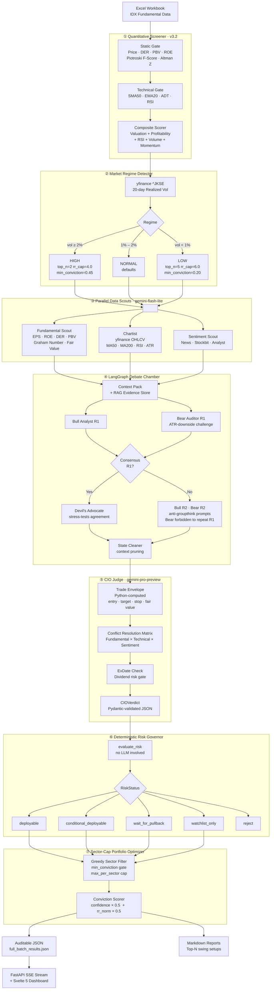

IDX Debate Engine
> An institutional-grade, multi-agent AI research pipeline for swing-trade analysis on the Indonesian Stock Exchange (IDX/IHSG).
Built for decision-support, not decision-making. This system automates the transition from quantitative screening to structured qualitative auditing through a LangGraph-powered debate architecture — engineered to surface blind spots, enforce financial guardrails, and produce auditable, deterministic trade setups.
---


---
System Architecture
The pipeline is sequential at the batch level and parallel at the agent level. Each ticker traverses the entire graph before the next one begins, ensuring clean state isolation and predictable token budgeting.

---
Technical Highlights
1. LangGraph Multi-Agent Debate Chamber
File: `services/debate_chamber.py` (117 KB) · Prompt corpus: `services/debate_prompts/`
The debate engine models an institutional investment committee using a LangGraph `StateGraph` with typed `DebateChamberState`. The architecture is purpose-built to counteract positive-bias common in single-prompt LLM analysis.
Scout Phase (parallel, gemini-flash-lite):
Three specialized agents run concurrently to extract distinct signal types before the debate begins:
Fundamental Scout — EPS TTM, ROE, DER, PBV, Graham Number margin of safety, and multi-method fair value from `services/fair_value_calculator.py`
Chartist — consumes real OHLCV from yfinance; MA50, MA200, RSI, and ATR are pre-computed in Python before LLM injection. The CIO judge cannot invent prices — it receives a Python-calculated Trade Envelope verbatim
Sentiment Scout — news freshness scoring, Stockbit analyst signals, breaking-news detection with confidence adjustment
Debate Phase (up to 3 rounds):
Anti-groupthink protocol: Bull (R1 → R2) vs. Bear (R1 → R2). In R2, Bear is programmatically forbidden from repeating any argument from R1 and must challenge the Bull's margin of safety using ATR-based downside
Devil's Advocate node: triggered automatically if consensus is detected too early (Round 1). A contrarian agent stress-tests the agreement before it reaches the CIO
State Cleaner: prunes accumulated context between phases using a dedicated prompt to prevent token overflow in long debates
CIO Judge (gemini-pro-preview):
Applies a strict Conflict Resolution Matrix: `Fundamental ✅ + Technical ✅ → BUY`, `Fundamental ✅ + Technical ❌ → HOLD`, etc.
Checks disagreement type (`direction`, `valuation`, `catalyst`, `timing`) and applies corresponding confidence penalties (0.02–0.05)
Hard ExDate gate: if ex-dividend date is ≤7 days away, auto-disqualifies with AVOID regardless of fundamentals
Output is Pydantic-validated (`schemas/debate.py: CIOVerdict`) — LLM output that fails schema validation is rejected and retried
Token budget: 500k tokens per run. Flash models for all data extraction; Pro model reserved for CIO synthesis only.
---
2. Quantitative Screener (v3.2)
Files: `core/quant_filter/config.py`, `core/quant_filter/pipeline.py`
A multi-stage screening engine that processes IDX Excel workbooks (scraped from Stockbit/IDX) into a ranked candidate list. All filters are deterministic and configurable.
Stage 1 — Static Gate (hard excludes):
Minimum price Rp 100 (removes penny stocks with no institutional liquidity)
Sector-aware DER caps: banks allowed up to 8.0×, tech and healthcare capped at 1.0× (banking leverage is structural, not a risk signal)
Hard PBV ceiling of 6.0×; sector-relative PBV at 80th percentile
ROE ≥ 10% TTM
Piotroski F-Score ≥ 4 (eliminates deteriorating fundamentals)
Altman Z-Score > 1.1 (distress zone exclusion)
Excludes tickers on IDX Special Monitoring (`PEMANTAUAN KHUSUS`)
Stage 2 — Technical Gate:
Price ≥ SMA50 and ≥ EMA20 (trend alignment for swing entry)
RSI hard-reject above 80 (overbought exclusion)
20-day Average Daily Turnover ≥ Rp 5 billion (minimum institutional liquidity)
Minimum 60 OHLCV bars (data sufficiency)
Relative Strength vs. IHSG (1-month outperformance requirement)
Stage 3 — Composite Scoring (0–100):
Component	Weight	Method
Valuation	20	Graham Number gap, tiered: ≥50% → 100%, 20-50% → 70%, 5-20% → 40%
Profitability	10	ROE tiered: ≥25% → 100%, 15-25% → 70%, 10-15% → 40%
RSI Momentum	25	Accumulation zone (45-55) → 100%, Uptrend (55-70) → 80%, Oversold → 40%
Volume Momentum	25	Surge tiers: ≥2× → 100%, 1.5-2× → 70%, 1.1-1.5× → 40%
Price Momentum	20	22-day return vs. IHSG, tiered by outperformance
Piotroski F-Score ≥ 7 adds +5 bonus; ≤ 5 applies −5 penalty. Fresh breakout bonus: +15. Over-extended penalty: −15.
---
3. Market-Adaptive Regime Detection
File: `core/regime.py`
Indonesia's equity market lacks a public volatility index. The system builds its own regime signal by computing the 20-day realized volatility of `^JKSE` (IHSG) from daily returns via yfinance, running async to avoid blocking the event loop.
```
HIGH   (vol ≥ 2%)  →  top_n=2,  rpm_limit=5,   rr_cap=4.0,  min_conviction=0.45
NORMAL (1%–2%)     →  defaults (no override)
LOW    (vol < 1%)  →  top_n=5,  rpm_limit=15,  rr_cap=6.0,  min_conviction=0.20
```
Fetch failures (network timeout, yfinance rate-limit) fall back to `NORMAL` — the pipeline never aborts due to a regime detection error.
---
4. Deterministic Risk Governor
File: `core/risk_governor.py`
A fully deterministic, LLM-free gate that classifies every CIO verdict before it touches the portfolio optimizer. No randomness, no model calls — purely rule-based Python.
Hard reject codes (any one → `reject` status, no sizing allowed):
`rating_not_buyable` — verdict is AVOID or SELL
`overvalued` — current price exceeds fair value
`rr_too_low` — risk/reward ratio below 1.5×
`insufficient_technical_data` — OHLCV data too sparse for MA200 validation
Output statuses:
```
deployable           →  price inside entry range, full sizing allowed
conditional_deployable →  HOLD rating or counter-trend; sizing restricted
wait_for_pullback    →  setup valid, price above entry zone
watchlist_only       →  price below entry zone, monitor only
reject               →  hard disqualification
```
Additional checks: stop-loss must be below current price, target must be above current price, MA200 context validated for counter-trend detection. IDX tick size snapping enforced on all price levels (`utils/technicals.py: snap_to_tick`).
---
5. Adaptive Planner and Resilience Engine
Files: `core/adaptive_planner.py`, `core/failure_taxonomy.py`
External dependencies (Stockbit scraper, yfinance, Gemini API) are inherently unreliable. Instead of failing the entire batch on any error, the system uses a structured failure taxonomy to make context-aware recovery decisions.
Failure taxonomy (`core/failure_taxonomy.py`): Normalizes all exceptions into categorized error codes — `DNS`, `QUOTA`, `AUTHENTICATION`, `SCHEMA`, `TIMEOUT` — enabling deterministic routing logic that doesn't rely on raw exception message parsing.
Recovery actions (`PlanAction` enum):
`RETRY` — exponential backoff, max 2 attempts
`PROCEED_PARTIAL` — continue with missing data; apply 15% confidence penalty to final conviction score
`SKIP_TICKER` — exclude this ticker, proceed with batch
`FALLBACK` — switch to alternative data source
`ABORT_BATCH` — stop entire run (triggered when all providers are down, or ≥ 5 ticker failures in one batch)
`ESCALATE` — log critical event, notify operator
Stage-specific logic: Sentiment fetch failure → `PROCEED_PARTIAL` (non-critical data). Debate timeout → `RETRY` up to 2× then `SKIP_TICKER`. CIO verdict failure → `RETRY` up to 2× then `SKIP_TICKER`. Any auth or billing error → immediate `ABORT_BATCH` (prevent pointless API billing).
Every decision is written to the Execution Ledger (`core/execution_ledger.py`) as a queryable JSONL event stream with structured `EventType`, `EventSeverity`, and causal trace fields.
---
6. FastAPI Backend + Svelte 5 Dashboard
Files: `app/api/routers/stocks.py`, `app/ui/src/`
SSE Streaming Debate (`POST /api/debate/stream`):
The API streams live debate progress to the frontend using Server-Sent Events. A `StreamingDebateChamber` subclass intercepts every LangGraph graph event and pushes it into an `asyncio.Queue`. A consumer loop drains the queue concurrently while the orchestrator runs, emitting typed SSE frames:
```
{ type: "progress",  ticker, phase, pct }     — pipeline phase progress 0–100
{ type: "scout",     ticker, metrics }         — parallel scout results
{ type: "round",     ticker, data }            — Bull/Bear round arguments
{ type: "devil_advocate", ticker, question }   — Devil's Advocate trigger
{ type: "verdict",   ticker, result }          — final CIOVerdict + RiskDecision
{ type: "done",      ticker }                  — ticker complete
{ type: "error",     ticker, message }         — recoverable error
```
Heartbeat frames (`: heartbeat`) are emitted every 1 second on idle to prevent proxy timeout disconnections. Headers: `Cache-Control: no-cache`, `X-Accel-Buffering: no`, `Connection: keep-alive`.
In-Memory TTL Cache: Batch results are cached in memory with a 60-second TTL. Cache invalidation is dual-keyed: time-based TTL and file `mtime` comparison — if the results file is updated by a new batch run, the cache is invalidated immediately on the next request regardless of TTL. Manual invalidation is called after every streaming debate completes.
Svelte 5 Frontend (SvelteKit + TypeScript):
`DebateTimeline.svelte` — reactive SSE event consumer; renders live round arguments with auto-scroll and user scroll override
`CandidatesTable.svelte` — sortable, filterable results grid with RiskStatus color-coding
`ServerStatusBar.svelte` — API health polling
`Sidebar.svelte` — ticker navigation and session state
`ToastStack.svelte` — non-blocking error surface
Stores: `dashboard.ts`, `metadata.ts`, `session.ts`, `toast.ts` — reactive state management via Svelte runes
---
7. RAG Evidence Store
File: `services/rag_evidence_store.py`
A freshness-aware evidence selection layer that sits between the data scouts and the debate context. Prevents stale market data from being injected into agent prompts without a staleness warning.
Maximum 12 evidence chunks per bundle, hard-capped at 2,400 characters
Stale threshold: 86,400 seconds (24 hours)
Category weights: `fair_value=1.0`, `fundamental=0.9`, `technical=0.85`, `sentiment=0.6`, `exdate=0.7`, `metadata=0.3`
Chunks scored by relevance × freshness × category weight; top-K selected per bundle
---
8. Backtest Memory and Auto-Evaluator
Files: `core/backtest_memory.py`, `core/backtest_outcome_evaluator.py`
An append-only JSONL store (`TradeOutcome`) that persists every debate verdict with its trade parameters. The auto-evaluator re-reads open records and resolves them using historical OHLCV from yfinance — checking whether price hit the target, hit the stop-loss, or expired within the 63-day swing horizon.
This creates a feedback loop: verdict confidence and the scoring model can be calibrated against realized outcomes over time.
---
Project Structure
```text
IDX-Debate-Engine/
│
├── app/
│   ├── api/                        # FastAPI application
│   │   ├── routers/stocks.py       # SSE streaming, results, health endpoints
│   │   ├── result_adapter.py       # Normalizes raw JSON to frontend schema
│   │   ├── cache.py                # TTL + mtime dual-key cache
│   │   └── dependency_injections/  # API key and async DB session DI
│   ├── cli/
│   │   ├── commands/               # filter, debate, scan, pipeline, sector, serve
│   │   └── ui/                     # Rich console tables and progress
│   └── ui/                         # Svelte 5 / SvelteKit frontend
│       └── src/lib/
│           ├── components/         # DebateTimeline, CandidatesTable, Sidebar…
│           ├── stores/             # dashboard, metadata, session, toast
│           └── types/index.ts      # StockResult, DebateRound, DebateEvent types
│
├── core/
│   ├── regime.py                   # ^JKSE realized-vol regime classifier
│   ├── risk_governor.py            # Deterministic buyability gate
│   ├── portfolio_optimizer.py      # Greedy sector-cap diversifier
│   ├── adaptive_planner.py         # Failure recovery decision engine
│   ├── failure_taxonomy.py         # Exception → ErrorCode normalizer
│   ├── execution_ledger.py         # JSONL causal pipeline trace
│   ├── backtest_memory.py          # Append-only trade outcome store
│   ├── backtest_outcome_evaluator.py  # Auto-labels open records via yfinance
│   ├── explainability_auditor.py   # Read-only audit packet generator
│   ├── observation_store.py        # Per-agent observation persistence
│   ├── budget.py                   # Token budget enforcement
│   ├── quant_filter/               # v3.2 quantitative screener
│   │   ├── config.py               # All thresholds, weights, sector maps
│   │   └── pipeline.py             # Multi-stage filter pipeline
│   └── orchestrator/               # Top-level batch coordinator
│
├── services/
│   ├── debate_chamber.py           # LangGraph state machine (117 KB)
│   ├── debate_prompts/             # Versioned prompt corpus (manifest.json)
│   │   ├── cio_judge.txt           # CIO system prompt + Conflict Resolution Matrix
│   │   ├── bull_r1.txt / bull_r2.txt
│   │   ├── bear_r1.txt / bear_r2.txt
│   │   ├── devils_advocate.txt
│   │   ├── fundamental_scout.txt / chartist.txt / sentiment.txt
│   │   └── consensus.txt / state_cleaner.txt
│   ├── fair_value_calculator.py    # Multi-method IDX fair value engine
│   ├── rag_evidence_store.py       # Freshness-aware evidence selection
│   ├── context_pack_builder.py     # Assembles scout data into debate context
│   ├── report_formatter.py         # Markdown + JSON report generation
│   ├── news_fetcher.py             # Multi-source news aggregation
│   ├── explainability_auditor.py   # Agent vote auditing
│   └── single_agent_analyzer.py    # Lightweight non-debate analysis mode
│
├── providers/
│   ├── gemini.py                   # LangChain Gemini Flash/Pro adapter
│   ├── yfinance.py                 # OHLCV and index data wrapper
│   ├── stockbit.py                 # Stockbit API client (keystats, financials)
│   ├── idx.py                      # IDX website crawler
│   └── webcrawler.py               # Base Selenium/undetected-chromedriver
│
├── schemas/
│   ├── debate.py                   # CIOVerdict, DebateChamberState, DebateMessage
│   └── fundamental.py / stock.py … # Pydantic v2 data contracts
│
├── db/
│   ├── models/                     # SQLAlchemy async models
│   └── session.py                  # Async engine + session factory
│
├── repositories/                   # Async CRUD repository pattern
├── builders/                       # DB hydration and Excel parsing
├── utils/
│   ├── technicals.py               # snap_to_tick, compute_rsi, compute_atr
│   ├── market_data_cache.py        # Shared OHLCV cache across pipeline stages
│   └── logger_config.py / helpers.py
│
├── tests/                          # 342 test functions, 41 test files
├── docs/                           # Architecture notes, decision semantics
├── examples/                       # Sample sanitized output artifacts
├── output/                         # Generated reports (git-ignored)
├── orchestrator.py                 # Batch pipeline entry point
├── run_debate.py                   # Single-ticker debate runner
├── run_quant_filter.py             # Standalone quant filter
├── run_api.py                      # FastAPI server entry point
└── pyproject.toml
```
---
Setup and Installation
Prerequisites
Python 3.12
`uv` — fast Python package manager
Node.js 18+ and npm (for the Svelte dashboard only)
Google Chrome or Chromium (for Stockbit/IDX web scraping)
Gemini API key (required for live debate runs; not needed for dry-run mode)
Install Python Dependencies
```bash
git clone https://github.com/your-username/IDX-Debate-Engine.git
cd IDX-Debate-Engine
uv sync
```
Configure Environment
```bash
cp .env.example .env
```
Edit `.env` with your credentials:
```bash
# Required for live debate runs
GEMINI_API_KEY=your-gemini-api-key
GEMINI_FLASH_MODEL=gemini-3.1-flash-lite
GEMINI_PRO_MODEL=gemini-3.1-pro-preview

# Portfolio risk parameters (tune to your capital allocation)
PORTFOLIO_MAX_PER_SECTOR=2
PORTFOLIO_MIN_CONVICTION=0.30

# Regime thresholds (default: IHSG-calibrated)
REGIME_VOLATILITY_HIGH_THRESHOLD=0.02
REGIME_VOLATILITY_LOW_THRESHOLD=0.01
REGIME_VOLATILITY_LOOKBACK_DAYS=20
```
Install Frontend Dependencies
```bash
cd app/ui
npm install
cd ../..
```
---
Execution
Full Batch Pipeline (Orchestrator)
Runs the complete pipeline: quant filter → regime detection → parallel scouts → debate chamber → CIO verdict → risk governor → portfolio optimization → reports.
```bash
uv run idx pipeline
```
Dry-run mode (mock LLM responses, no API calls):
```bash
uv run python orchestrator.py --dry-run --no-interactive --output-dir tmp/dry_run
```
---
CLI Reference (`idx`)
The unified CLI entry point, powered by Typer with Rich console output.
```bash
# Run the quantitative screener against the latest IDX Excel workbook
uv run idx filter --top 10

# Run the debate chamber for specific tickers
uv run idx debate --tickers BBRI BBCA TLKM --output-dir output/debates

# Market scan — quick fundamental sweep
uv run idx scan

# Full pipeline via CLI
uv run idx pipeline

# Launch FastAPI server
uv run idx serve

# Sector analysis
uv run idx sector list
```
---
Run Isolated Debate
```bash
uv run debate BBCA ADRO
```
---
Regenerate Quantitative Candidates
```bash
uv run idx scan
```
---
Start the API Server
```bash
uv run idx serve
# FastAPI available at http://127.0.0.1:8000
# Interactive docs at http://127.0.0.1:8000/docs
```
Start the Svelte 5 Dashboard
In a separate terminal:
```bash
cd app/ui
npm run dev
# Dashboard at http://127.0.0.1:5173
```
---
Testing
The test suite covers unit tests, integration tests, and pipeline reliability tests across 41 test files.
```bash
# Run full test suite
uv run pytest -q

# Run with verbose output
uv run pytest -v

# Run specific module
uv run pytest tests/test_risk_governor.py -v
uv run pytest tests/test_debate_chamber_reliability.py -v
uv run pytest tests/test_adaptive_planner.py -v
```
Code quality:
```bash
# Type-check all modules
uv run python -m compileall -q .

# Lint with Ruff
uv run ruff check .
```
Key test modules:
File	Coverage
`test_debate_chamber_reliability.py`	LangGraph state machine, partial failure, schema validation
`test_risk_governor.py`	All `RiskStatus` paths, edge cases, IDX tick compliance
`test_adaptive_planner.py`	All `PlanAction` branches, batch abort conditions
`test_quant_filter_pipeline.py`	Full screener pipeline, sector-DER matrix, scoring tiers
`test_backtest_outcome_evaluator.py`	OHLCV-based outcome labeling, horizon expiry
`test_fair_value_calculator.py`	Graham Number, DDM, multi-method valuation
`test_rag_evidence_store.py`	Freshness scoring, chunk selection, stale data handling
`test_execution_ledger.py`	JSONL event writes, causal trace queries
`test_regime.py`	Volatility classification, safe fallback on fetch failure
`api/test_dashboard_api.py`	SSE stream, cache invalidation, health endpoint
---
License
MIT License — see `pyproject.toml`. This software is built for research and decision-support. It does not constitute financial advice.