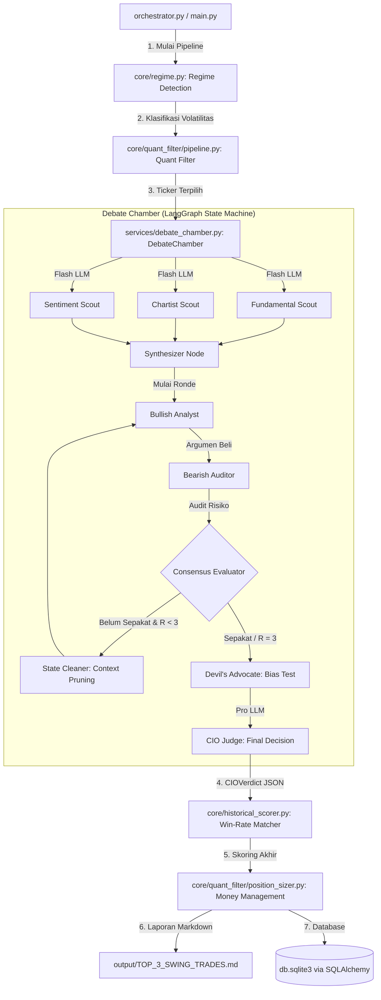

# IDX Debate Engine

> **A structured multi-agent research pipeline for swing-trade analysis on the Indonesian Stock Exchange (IDX/IHSG).**

Built for *decision-support*, not decision-making. This system automates the transition from quantitative screening to structured qualitative review through a **LangGraph-powered debate architecture** — engineered to surface blind spots, apply deterministic financial guardrails, and produce reviewable trade setups.

## Live Demo — Debate Chamber CLI

<p align="center">
  
</p>

<p align="center"><em>
  Rich terminal dashboard running <code>uv run idx debate BBRI</code> — showing the Trade Plan & Valuation panel, Agent Voting & Integration matrix, Bull vs Bear key arguments, Decision Summary, System & Risk Management flags, and the final Debate Results table. All in real-time.
</em></p>

---

## Table of Contents

- [System Architecture](#system-architecture)
- [Sample AI Debate Output](#sample-ai-debate-output)
- [Technical Highlights](#technical-highlights)
  - [LangGraph Multi-Agent Debate Chamber](#1-langgraph-multi-agent-debate-chamber)
  - [Quantitative Screener (v3.2)](#2-quantitative-screener-v32)
  - [Market-Adaptive Regime Detection](#3-market-adaptive-regime-detection)
  - [Deterministic Risk Governor](#4-deterministic-risk-governor)
  - [Adaptive Planner & Resilience Engine](#5-adaptive-planner--resilience-engine)
  - [Evidence Ranker](#6-evidence-ranker)
- [Project Structure](#project-structure)
- [Setup & Installation](#setup--installation)
- [Execution & CLI Reference](#execution--cli-reference)
- [Testing](#testing)
- [License](#license)

---

## System Architecture

The pipeline is **sequential at the batch level** and **parallel at the agent level**. Each ticker traverses the entire graph before the next one begins, ensuring clean state isolation and predictable token budgeting.



---

## Sample AI Debate Output

What makes this engine unique is how it forces **Bearish Auditors** to challenge **Bullish Analysts** round-by-round, culminating in a structured JSON decision by the **CIO Judge**.

Here is an example snippet of a JSON output when the CIO decides to **HOLD** despite strong technicals, because the Bear exposed a deteriorating margin of safety:

```json
{
  "ticker": "BBRI",
  "verdict": "HOLD",
  "confidence": 0.65,
  "reasoning": "The Bullish Analyst correctly identifies the golden cross on MA50 and strong institutional accumulation. However, the Bearish Auditor raises a critical point in Round 2: the margin of safety (Graham Valuation) has shrunk to 3%, and NPL (Non-Performing Loans) data shows a slight uptick in the micro-segment. Given the current HIGH market volatility regime, the risk/reward ratio of 1.2 is insufficient for a fresh entry.",
  "bull_key_argument": "Strong technical breakout (RSI 62, Price > MA200) supported by record dividend yield.",
  "bear_key_argument": "Valuation is stretched (PBV 2.8x vs Sector 1.5x); downside risk to SMA20 support is -8%.",
  "recommended_action": {
    "entry_price": 4800,
    "target_price": 5200,
    "stop_loss": 4650,
    "risk_reward_ratio": 1.2
  },
  "risk_flags": ["VALUATION_STRETCHED", "NPL_CONCERN"]
}
```

---

## Technical Highlights

### 1. LangGraph Multi-Agent Debate Chamber

**File:** [`debate_chamber.py`](services/debate_chamber.py) &nbsp;·&nbsp; **Prompt corpus:** [`debate_prompts/`](services/debate_prompts/)

The debate engine models a structured investment committee workflow using a LangGraph `StateGraph` with typed `DebateChamberState`. The architecture is purpose-built to counteract positive-bias common in single-prompt LLM analysis.

**Scout Phase** *(parallel, gemini-flash-lite):*
- **Fundamental Scout**: EPS TTM, ROE, DER, PBV, Graham Number, multi-method fair value.
- **Chartist**: MA50, MA200, RSI, ATR — pre-computed in Python, not LLM-generated.
- **Sentiment Scout**: News freshness scoring, Stockbit analyst signals.

**Debate Phase** *(up to 3 rounds):*
- **Anti-groupthink protocol:** Bull (R1 → R2) vs. Bear (R1 → R2). In R2, Bear is programmatically forbidden from repeating any argument from R1 and must challenge the Bull's margin of safety using ATR-based downside.
- **Devil's Advocate node:** triggered automatically if consensus is detected too early (Round 1). A contrarian agent stress-tests the agreement before it reaches the CIO.

**CIO Judge** *(gemini-pro-preview):*
- Applies a strict **Conflict Resolution Matrix**: `Fundamental ✅ + Technical ✅ → BUY`, `Fundamental ✅ + Technical ❌ → HOLD`, etc.

### 2. Quantitative Screener (v3.2)

**Files:** [`config.py`](core/quant_filter/config.py) · [`pipeline.py`](core/quant_filter/pipeline.py)

A multi-stage screening engine that processes IDX Excel workbooks into a ranked candidate list. All filters are deterministic and configurable.
- **Stage 1 (Static Gate):** Hard excludes (DER cap, PBV ceiling, ROE floor > 10%, Altman Z-Score > 1.1).
- **Stage 2 (Technical Gate):** Price > SMA50, RSI < 80, Min ADT Rp 5B.
- **Stage 3 (Composite Scoring):** 70/30 Technical-Fundamental split optimized for swing trading momentum.

### 3. Market-Adaptive Regime Detection

**File:** [`regime.py`](core/regime.py)

Indonesia's equity market lacks a public volatility index. The system builds its own regime signal by computing the **20-day realized volatility** of `^JKSE` (IHSG) from daily returns via yfinance. Volatility directly controls API concurrency (`rpm_limit`), risk-reward caps, and minimum AI confidence thresholds.

### 4. Deterministic Risk Governor

**File:** [`risk_governor.py`](core/risk_governor.py)

A fully deterministic, **LLM-free gate** that classifies every CIO verdict before it touches the portfolio optimizer. No randomness, no model calls — purely rule-based Python.
- Forces all LLM-generated prices to snap to the official IDX tick size (`snap_to_tick`).
- Rejects trades where the LLM hallucinated a target below the current price.
- Validates Risk/Reward ratio strictly > 1.5x.

### 5. Adaptive Planner & Resilience Engine

**Files:** [`adaptive_planner.py`](core/adaptive_planner.py) · [`failure_taxonomy.py`](core/failure_taxonomy.py)

External dependencies (Stockbit scraper, yfinance, Gemini API) are inherently unreliable. Instead of failing the entire batch on any error, the system uses a structured **failure taxonomy** to make context-aware recovery decisions (`PROCEED_PARTIAL`, `SKIP_TICKER`, `FALLBACK`, `ABORT_BATCH`).

### 6. Evidence Ranker

**File:** [`evidence_ranker.py`](services/evidence_ranker.py)

A freshness-aware, deterministic evidence selection and ranking layer between the data scouts and the debate context. To prevent prompt overflow and minimize token spend, it filters and scores normalized `ContextPack` chunks by category, query keywords, and per-source freshness.

---

## Project Structure

```text
IDX-Debate-Engine/
├── app/
│   ├── api/                        # FastAPI application (SSE streaming)
│   └── cli/                        # Rich console UI and Typer commands
├── core/
│   ├── regime.py                   # ^JKSE realized-vol regime classifier
│   ├── risk_governor.py            # Deterministic buyability gate
│   ├── portfolio_optimizer.py      # Greedy sector-cap diversifier
│   ├── adaptive_planner.py         # Failure recovery decision engine
│   └── quant_filter/               # v3.2 quantitative screener
├── services/
│   ├── debate_chamber.py           # LangGraph state machine (117 KB)
│   ├── debate_prompts/             # Versioned prompt corpus (manifest.json)
│   └── fair_value_calculator.py    # Multi-method IDX fair value engine
├── providers/
│   ├── gemini.py                   # LangChain Gemini Flash/Pro adapter
│   ├── yfinance.py                 # OHLCV and index data wrapper
│   └── stockbit.py                 # Stockbit API client
├── schemas/                        # Pydantic v2 data contracts
├── db/                             # SQLAlchemy async models
├── tests/                          # 49 test modules
├── output/                         # Generated JSON/Markdown reports
└── orchestrator.py                 # Batch pipeline entry point
```

---

## Setup & Installation

### 🚀 Quick Install (Windows PowerShell)

The fastest way to install the engine, setup the environment, and install dependencies automatically. Open **PowerShell** (not CMD) and run:

```powershell
irm https://raw.githubusercontent.com/naufalhajid/IDX-Debate-Engine/main/install.ps1 | iex
```

Avoid piping remote scripts directly into `iex` unless you have reviewed and trusted the exact script content.

### Manual Installation

| Requirement | Version | Notes |
|---|---|---|
| Python | 3.14+ | Runtime |
| [`uv`](https://docs.astral.sh/uv/) | latest | Fast Python package manager |

```bash
git clone https://github.com/naufalhajid/IDX-Debate-Engine.git
cd IDX-Debate-Engine
uv sync
```

---

## Execution & CLI Reference

All commands are accessed through the unified `idx` CLI, powered by [Typer](https://typer.tiangolo.com/).

### 1. Authentication (Required)
Before running the engine, you must configure your Gemini API Key and other credentials:
```bash
uv run idx auth
```

### 2. Run Full Batch Pipeline
Runs the complete pipeline end-to-end: quant filter → regime detection → parallel scouts → debate chamber → CIO verdict → risk governor → portfolio optimization → reports.
```bash
uv run idx pipeline
```

### 3. Individual Commands

```bash
# ── Quantitative Screener ────────────────────────
uv run idx filter --top 10          # Filter and rank candidates
uv run idx scan                     # Quick fundamental sweep

# ── Debate Chamber ───────────────────────────────
uv run idx debate BBRI BBCA TLKM    # Run debate for specific tickers
uv run idx debate BBRI --output-dir output/debates

# ── Sector Analysis ──────────────────────────────
uv run idx sector list              # List sector classifications
```

---

## Testing

The test suite spans **49 test modules** covering unit tests, integration tests, and pipeline reliability tests.

```bash
uv run pytest -v
```

---

## License

MIT License — see [`pyproject.toml`](pyproject.toml). This software is built for research and decision-support. **It does not constitute financial advice.**
