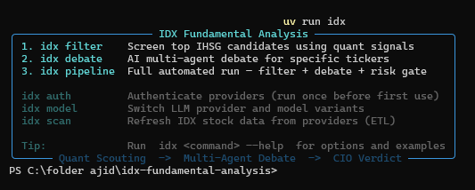
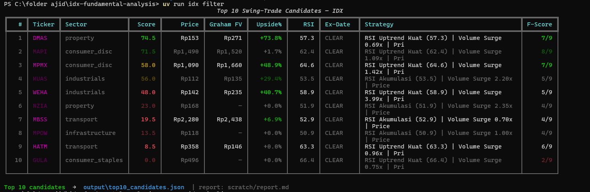
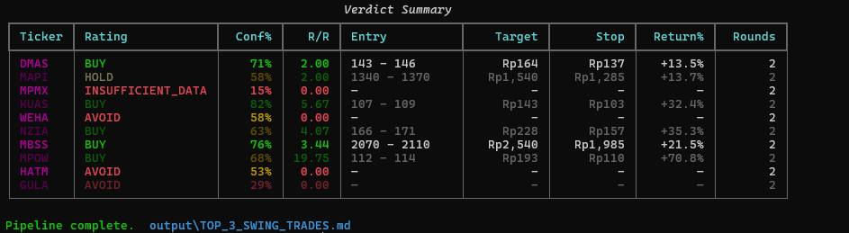
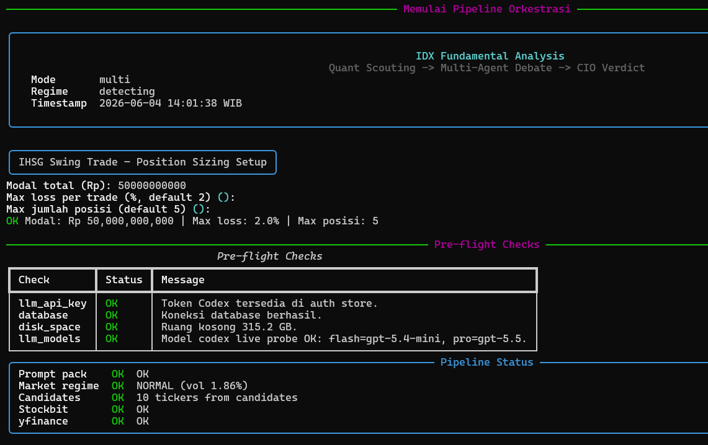

# IDX Debate Engine

> **A multi-agent AI decision-support pipeline that fights back against information asymmetry in the Indonesian Stock Exchange.**

Indonesia has over 13 million retail investors, but nearly all of them make decisions without access to the structured, multi-angle analysis that institutional traders take for granted. This engine closes that gap by automating an investment committee workflow: multiple AI agents argue opposite sides of each stock, and a CIO judge makes the final call backed by deterministic financial guardrails.

**Built for decision-support, not decision-making.**

---

## Live Demo

<p align="center">
  
</p>

<p align="center">
  
</p>

<p align="center"><em>
  <code>uv run idx filter</code>: quantitative screener ranks all IDX-listed stocks by composite score, showing valuation context, RSI, liquidity/momentum signals, and strategy signal per ticker.
</em></p>

<p align="center">
  
</p>

<p align="center"><em>
  <code>uv run idx debate</code>: live debate: Trade Plan & Valuation, Agent Voting matrix (Bull / Bear / Chartist / Scouts), Key Arguments, and final CIO Verdict with Risk Governor.
</em></p>

<p align="center">
  
</p>

<p align="center"><em>
  Pipeline final output: Verdict Summary across all debated tickers, with ratings, confidence %, risk/reward ratios, entry zones, targets, and stops.
</em></p>

---

## The Problem

Retail investors in Indonesia face a structural disadvantage:

- **No access to structured analysis**: institutional desks have teams of analysts; retail investors have Twitter and gut feeling
- **Single-perspective LLM analysis is dangerously biased**: asking an AI "should I buy BBRI?" produces a confident-sounding answer with no stress-test
- **Market manipulation by "bandar"** (large operators) exploits retail traders who don't have the tools to separate signal from noise

This engine builds the counter-system: one AI argues bull, one argues bear, a third stress-tests both, and a CIO judge applies a strict conflict-resolution matrix before a trade is approved.

---

## How the Pipeline Works

```
Quant Screener -> Regime Context -> Trade Envelope -> Debate/CIO -> Risk Governor -> Ranking/Sizing -> Display Packet -> Report
```

The production path has one authority chain. Forecasting, fair value, research
comparison, and long-form audits can inform the report, but they do not silently
override entry/target/stop, ranking, sizing, or deployability.

| Lifecycle | Can affect default `idx pipeline` decisions? | Current examples |
| --- | --- | --- |
| Production | Yes, through explicit stage ownership | Quant screener, regime context, trade envelope, CIO verdict, Risk Governor, ranking, position sizing, report artifacts |
| Advisory | Display/context only by default | Fair value range, forecast report, news context, historical outcome hints |
| Research | Only when an explicit command is used | `idx research compare`, forecast validation, backtest recalibration, diagnostic scripts |
| Archived | No runtime authority | Historical audit docs, archived prompt contracts, legacy compatibility artifacts |

<p align="center">
  
</p>

<p align="center"><em>
  Before every batch run, the pipeline performs pre-flight checks: API connectivity, database, disk space, and live LLM model probes: all must be green before any debate begins.
</em></p>

### A real output: what the CIO decides

```json
{
  "ticker": "BBRI",
  "verdict": "HOLD",
  "confidence": 0.65,
  "reasoning": "The Bullish Analyst correctly identifies the golden cross on MA50 and strong institutional accumulation. However, the Bearish Auditor raises a critical point in Round 2: the technical trade envelope only produces a 1.2x risk/reward ratio in the current HIGH volatility regime. Valuation is shown as context, not as the deployability owner.",
  "trade_envelope": {
    "entry_price": 4800,
    "target_price": 5200,
    "stop_loss": 4650,
    "risk_reward_ratio": 1.2
  },
  "risk_governor": {
    "status": "reject",
    "sizing_allowed": false,
    "reason_codes": ["rr_too_low"]
  },
  "advisory_context": {
    "valuation": "visible when verified; suppressed or labeled when unverified",
    "forecast": "advisory unless FORECAST_EV_RANKING_ENABLED=true"
  }
}
```

Current ownership additions worth knowing:

- `core/orchestrator/runner.py` is the narrow production runner facade.
- `core/trade_envelope.py` owns deterministic entry, target, stop, and R/R.
- `services/display_packet.py` owns normalized report/display semantics before
  Markdown or Rich rendering.

---

## System Architecture

The pipeline is coordinated by a narrow `PipelineRunner` facade. Batch execution
keeps output paths backward-compatible, while new production code should prefer
public runner/service APIs over private helpers in `core/orchestrator/legacy.py`.

```mermaid
graph LR
    EP["orchestrator.py / idx pipeline"] -->|1. Start| RUN["core/orchestrator/runner.py: PipelineRunner"]
    RUN --> MR["core/regime.py: Regime Context"]
    MR --> QF["core/quant_filter/pipeline.py: Quant Filter"]
    QF --> TE["core/trade_envelope.py: Trade Envelope"]
    TE --> DC["services/debate_chamber.py: DebateChamber"]

    subgraph SUB_DC ["Debate Chamber (LangGraph State Machine)"]
        direction LR
        DC -->|Flash LLM| FS[Fundamental Scout]
        DC -->|Flash LLM| CS[Chartist Scout]
        DC -->|Flash LLM| SS[Sentiment Scout]

        FS --> SYN[Synthesizer Node]
        CS --> SYN
        SS --> SYN

        SYN -->|Round Start| BA[Bullish Analyst]
        BA -->|Buy Argument| BR[Bearish Auditor]
        BR -->|Risk Audit| CE{Consensus Evaluator}

        CE -->|"No Consensus & R < 3"| SC["Context Pruning / State Cleaner"]
        SC --> BA

        CE -->|Consensus / R = 3| DA["Devil's Advocate: Bias Test"]
        DA -->|Pro LLM| CJ["CIO Judge: Final Decision"]
    end

    CJ --> RG["core/risk_governor.py: Deployability Gate"]
    RG --> HS["core/historical_scorer.py: Advisory Outcome Context"]
    RG --> RANK["Ranking / Top Selection"]
    RANK --> PSIZ["core/quant_filter/position_sizer.py: Money Management"]
    PSIZ --> DP["services/display_packet.py: Display Semantics"]
    DP --> OUT["Markdown / JSON Reports"]
    PSIZ --> DB[("db/idx-fundamental.db via SQLAlchemy")]
```



---

## Technical Highlights

### 1. LangGraph Multi-Agent Debate Chamber

**File:** [`services/debate_chamber.py`](services/debate_chamber.py) &nbsp;·&nbsp; **Prompt corpus:** [`services/debate_prompts/`](services/debate_prompts/)

A LangGraph `StateGraph` with typed `DebateChamberState`, purpose-built to counteract the positive bias common in single-prompt LLM analysis.

**Scout Phase** *(parallel, gemini-flash-lite):*
- **Fundamental Scout**: EPS TTM, ROE, DER, PBV, and verified valuation context
- **Chartist**: MA50, MA200, RSI, ATR (pre-computed in Python, not LLM-generated)
- **Sentiment Scout**: News freshness scoring, Stockbit analyst signals

**Debate Phase** *(up to 3 rounds):*
- **Anti-groupthink protocol:** Bull vs Bear across rounds. In Round 2, the Bear is programmatically forbidden from repeating any argument from Round 1; it must challenge the Bull's margin of safety using ATR-based downside
- **Devil's Advocate node:** triggered automatically if consensus appears too early, before it reaches the CIO

**CIO Judge** *(configured pro LLM):*
- Applies a strict **Conflict Resolution Matrix**: `Fundamental ✅ + Technical ✅ → BUY`, `Fundamental ✅ + Technical ❌ → HOLD`, etc.

### 2. Deterministic Trade Envelope

**File:** [`core/trade_envelope.py`](core/trade_envelope.py)

The debate chamber no longer owns the trade geometry implementation. Entry,
target, stop, R/R, noise rejection, resistance-first target selection, and
sector swing caps are computed in a deterministic service before the CIO verdict
is interpreted.

### 3. Quantitative Screener (v3.2)

**Files:** [`core/quant_filter/config.py`](core/quant_filter/config.py) · [`core/quant_filter/pipeline.py`](core/quant_filter/pipeline.py)

Multi-stage screening across all IDX-listed stocks:
- **Stage 1 (Static Gate):** Hard excludes: DER cap, PBV ceiling, ROE floor > 10%, Altman Z-Score > 1.1
- **Stage 2 (Technical Gate):** Price > SMA50, RSI < 80, Min ADT Rp 5B
- **Stage 3 (Composite Scoring):** 70/30 Technical-Fundamental split optimised for swing trading momentum

### 4. Market-Adaptive Regime Detection

**File:** [`core/regime.py`](core/regime.py)

Indonesia's equity market has no public volatility index. The system builds its own regime signal: **20-day realized volatility** of `^JKSE` (IHSG) computed from daily returns via yfinance. Volatility directly controls API concurrency, risk-reward caps, and minimum AI confidence thresholds.

### 5. Deterministic Risk Governor

**File:** [`core/risk_governor.py`](core/risk_governor.py)

A fully deterministic, **LLM-free gate** that classifies every CIO verdict before it reaches the portfolio optimizer:
- Rejects trades where the LLM hallucinated a target below the current price or a stop above it
- Validates the Risk/Reward ratio against a tier-aware floor (1.3x for large-caps ≥ Rp 50T, 1.5x default) — recomputing it from entry/target/stop when the verdict omits it
- Downgrades executable setups to watchlist-only during DEFENSIVE market regimes
- Treats verified overvaluation as a deployability concern only under explicit
  policy conditions; otherwise valuation remains advisory context

(All entry/target/stop prices are snapped to official IDX tick sizes upstream in
the Python-computed trade envelope.)

### 6. Display Packet and Report Semantics

**Files:** [`services/display_packet.py`](services/display_packet.py) - [`services/report_formatter.py`](services/report_formatter.py)

Reports consume normalized display state instead of inventing policy from raw
internals. This keeps Markdown, Rich CLI, API, and future UI surfaces aligned on
actionability labels, valuation visibility, forecast status, breaking-news
warnings, and Risk Governor messaging.

### 7. Adaptive Planner & Resilience Engine

**Files:** [`core/adaptive_planner.py`](core/adaptive_planner.py)

Structured failure taxonomy for inherently unreliable external dependencies (Stockbit, yfinance, Gemini API). Instead of crashing the batch on any error, the system makes context-aware recovery decisions: `PROCEED_PARTIAL`, `SKIP_TICKER`, `FALLBACK`, `ABORT_BATCH`.

### 8. Evidence Ranker

**File:** [`services/evidence_ranker.py`](services/evidence_ranker.py)

A freshness-aware, deterministic selection layer between data scouts and debate context. Filters and scores normalized `ContextPack` chunks by category, query keywords, and per-source freshness, preventing prompt overflow and minimising token spend.

---

## Project Structure

```text
IDX-Debate-Engine/
├── app/
│   ├── api/                        # FastAPI application (SSE streaming)
│   ├── cli/                        # Rich console UI and Typer commands
│   └── ui/                         # Svelte 5 + SvelteKit frontend dashboard
├── core/
│   ├── orchestrator/               # PipelineRunner facade + legacy compatibility
│   ├── regime.py                   # ^JKSE realized-vol regime classifier
│   ├── trade_envelope.py           # Deterministic entry/target/stop/R/R owner
│   ├── risk_governor.py            # Deterministic buyability gate
│   ├── portfolio_optimizer.py      # Greedy sector-cap diversifier
│   ├── adaptive_planner.py         # Failure recovery decision engine
│   └── quant_filter/               # v3.2 quantitative screener
├── services/
│   ├── debate_chamber.py           # LangGraph state machine
│   ├── debate_prompts/             # Versioned prompt corpus (manifest.json)
│   ├── display_packet.py           # Normalized report/display semantics
│   └── fair_value_calculator.py    # Multi-method IDX fair value engine
├── providers/
│   ├── gemini.py                   # LangChain Gemini Flash/Pro adapter
│   └── stockbit.py                 # Stockbit API client
├── schemas/                        # Pydantic v2 data contracts
├── db/                             # SQLAlchemy async models
├── tests/                          # pytest suite
├── output/                         # Generated Markdown trade reports
└── orchestrator.py                 # Batch pipeline entry point
```

---

## Setup & Installation

**Requirements:** Python 3.12+, [`uv`](https://docs.astral.sh/uv/)

```bash
git clone https://github.com/naufalhajid/IDX-Debate-Engine.git
cd IDX-Debate-Engine
uv sync
uv run idx auth        # configure API keys
uv run idx pipeline    # run full batch
```

### Individual Commands

```bash
uv run idx filter                   # Momentum swing screener
uv run idx filter mr                # Mean-reversion swing screener
uv run idx pipeline                 # Full momentum pipeline
uv run idx pipeline mr              # Full mean-reversion pipeline
uv run idx pipeline choose          # Interactive mode selector
uv run idx research compare         # Explicit single-vs-multi research comparison
uv run idx backtest evaluate-open   # Explicit backtest-memory maintenance
uv run idx debate BBRI BBCA TLKM    # Debate specific tickers
uv run idx scan                     # Quick fundamental sweep
```

When Codex is the active LLM provider, `idx pipeline` runs in fast batch mode by
omitting Codex reasoning effort unless you pass 1-3 explicit tickers. Use
`idx debate` for deep per-ticker reasoning with the configured Codex effort.

For scripts and CI, the explicit flags remain available:

```bash
uv run idx filter --mode mean-reversion --top 10
uv run idx research compare --screener-mode mean-reversion
```

---

## Testing

The pytest suite covers unit, integration, report, risk-governor, CLI, and
pipeline reliability behavior.

```bash
uv run pytest -v
uv run pytest tests/test_debate_chamber_reliability.py -v
```

---

## Tech Stack

| Layer | Technology |
|---|---|
| Agent orchestration | LangGraph (StateGraph) |
| LLM providers | Google Gemini Flash / Pro, Anthropic Claude, OpenAI (via Codex adapter) |
| API framework | FastAPI with SSE streaming |
| CLI | Typer + Rich |
| Data | yfinance, Stockbit API |
| Persistence | SQLAlchemy async + SQLite |
| Validation | Pydantic v2 |

LLM provider can be switched interactively at runtime (no code changes needed):

<p align="center">
  
</p>

---

## License

MIT License: This software is built for research and decision-support. **It does not constitute financial advice.**
